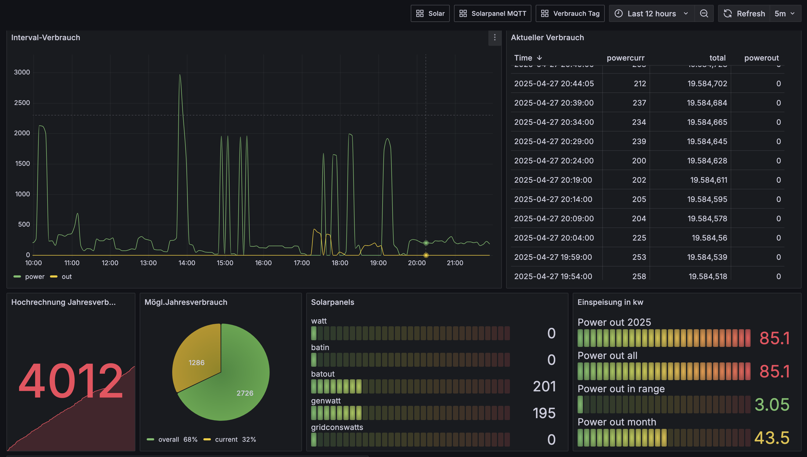
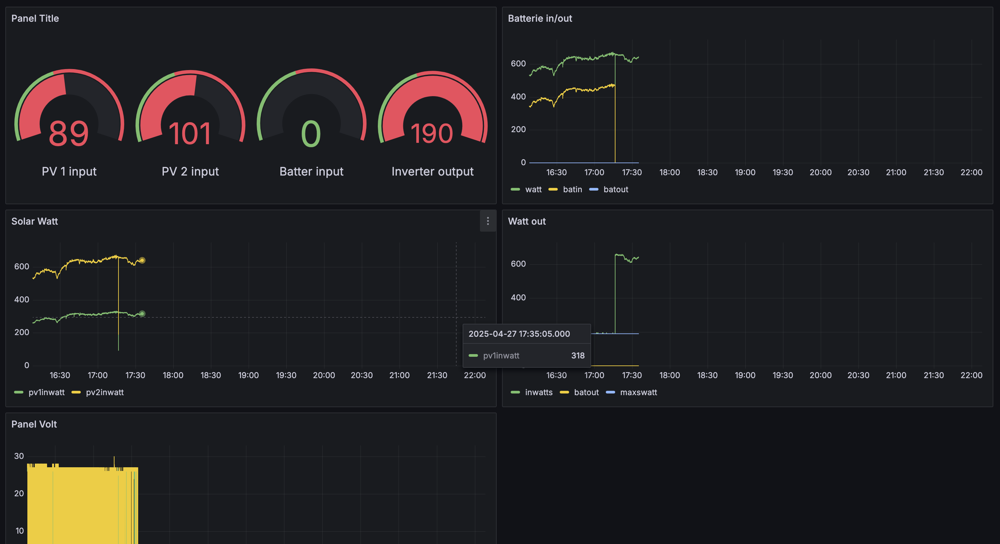

# Mqtt2db application

- [Mqtt2db application](#mqtt2db-application)
  - [Introduction](#introduction)
  - [Build](#build)
  - [Workflow](#workflow)
  - [Environment in Docker container](#environment-in-docker-container)
  - [Podman start command](#podman-start-command)
  - [Usage in Grafana](#usage-in-grafana)
  - [Summary](#summary)

## Introduction

This `mqtt2db` application stores data events received from MQTT. The MQTT data is collected by an Tasmota smart meter reader. The Tasmota module sends the received smart meter data to an Mosquitto MQTT server. This MQTT events are stored into a postgres database by `mqtt2db`.

## Build

The `mqtt2db` application is written in Golang. The tool can be build with

```sh
build.sh
```

## Workflow

Inside MQTT the corresponding MQTT message need to be predefined like this:

```json
{
   "Time": "2023-09-02T21:43:20",
   "eHZ":{
      "E_in": 23446.07,
      "Power": 372,
      "E_out": 123,
   }
}
```

The structure is defined in an historical matter and can be adapted to the environment and Tasmota script definitions.

During startup phase of the `mqtt2db` application

- if not exists, create the database table is created with an id and corresponding MQTT data fields
- create an trigger and function creating the current timestamp into the record field "inserted_on"
- create an ascending and descending index of "inserted_on"

`mqtt2db` creates a connection to an postgres database and an Mosquitto MQTT server listening on the given topic.

When `mqtt2db` has received a message then the message will be inserted into postgres.
The interval for each event entry will be defined by Tasmota MQTT configuration.

## Environment in Docker container

I manage to run the overall application

- Mosquitto
- Postgres
- `mqtt2db`
- Grafana

all are running in a Docker container or Podman pod.


Tasmota server is sending the MQTT messages to my MQTT Mosquitto server. Here it is optional to listen with other application to that MQTT messages. My `mqtt2db` application listen to the messages and writes all into the Postgres database.
With minimal afford the destination database may be another MariaDB or even Adabas databases.

The corresponding Tasmota power level message is configured to send each minute.

## Podman start command

The Mqtt2db application and corresponding Postgres database is running in an Raspberry Pi.

Docker images are on Docker hub at

```docker
docker pull thknie/mqtt2db:tagname
```

See the example script showing how to start the service with podman. Located is the script in this repostiory at [docker/podstart.sh](docker/podstart.sh).
Corresponding environment variable need to be defined. This script will create a podman pod named `mqtt_pod`.

```sh
podman pod create \
   --name mqtt_pod --publish 1883:1883  --publish 9001:9001 --publish 5432:5432
podman run --name postgres --pod mqtt_pod \
        -v $PGBACKUP:/backup \
        -v $PGDATA:/var/lib/postgresql/data \
        -e TZ=Europe/Berlin \
        -e POSTGRES_PASSWORD=${POSTGRES_PASSWORD} \
        -e POSTGRES_DB=bitgarten \
        -d docker.io/library/postgres:${PODSTART_VERSION}
podman run --name mqtt5 --pod mqtt_pod --user=501:20 \
        -v $MQTT_CONFIG:/mosquitto/config:rw \
        -v $MQTT_DATA:/mosquitto/data:rw \
        -v $MQTT_LOG:/mosquitto/log:rw \
        -e TZ=Europe/Berlin \
        -d docker.io/library/eclipse-mosquitto
podman run --name mqtt2db --pod mqtt_pod \
        -e TZ=Europe/Berlin \
        -e MQTT_STORE_URL=postgres://postgres:5432/bitgarten \
        -e MQTT_STORE_TABLENAME=home \
        -e MQTT_STORE_PASS=$POSTGRES_PASSWORD \
        -e MQTT_TOPIC_URL=mqtt5:1883 \
        -e MQTT_TOPIC=tele/tasmota_9291A6/SENSOR \
        -e MQTT_TOPIC_USERNAME=$MQTT_USER \
        -e MQTT_TOPIC_PASSWORD=$MQTT_PASSWORD \
        -d github.com/tknie/mqtt2db:latest
```

## Usage in Grafana

In Grafana accessing the data source containing the data received by two input sources

- First sources comes from [mqtt2db](https://github.com/tknie/mqtt2db). This tool receives Tasmota electric meter data using an Mosquitto MQTT server and store it in database
- Second sources comes from [ecoflow2db](https://github.com/tknie/ecoflow2db) using the Ecoflow API receiving Solar panel and inverter statistics and store it in the same database

Both data are containing a wide range of statistic data which can be presented inside an Grafana Dashboard:





## Summary

The `mqtt2db` offers easy store of MQTT power messages to store into Postgres. It may be help for developers to work with similar approaches storing MQTT data into databases.

______________________
These tools are provided as-is and without warranty or support. Users are free to use, fork and modify them, subject to the license agreement. 