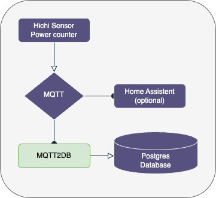

# Tasmota MQTT store into postgres (draft)

## Introduction

This small application stores MQTT data received by Tasmota via MQTT server into a postgres database.

## Workflow

Inside MQTT the corresponding MQTT message need to be predefined like this:

```json
{
   "Time": "2023-09-02T21:43:20",
   "":{
      "total_in": 23446.07,
      "Power_curr": 372
   }
}
```

During startup phase of the MQTT2DB application

- if not exists, create the database table is created with an id and corresponding MQTT data fields
- create an trigger and function creating the current timestamp into the record field "inserted_on"
- create an ascending and descending index of "inserted_on"

MQTT2DB creates a connection to an postgres database and an Mosquitto MQTT server listening on the given topic.

When MQTT2DB has received a message then the message will be inserted into postgres.
The interval for each event entry will be defined by Tasmota MQTT configuration.

## Environment in Docker container

I manage to run the overall application

- Mosquitto
- Postgres
- MQTT2DB
- Grafana

all are running in a Docker container or Podman pod.



Tasmota server is sending the MQTT messages to my MQTT Mosquitto server. Here it is optional to listen with other application to that MQTT messages. My MQTT2DB application listen to the messages and writes all into the Postgres database.
With minimal afford the destination database may be another MariaDB or even Adabas databases.

The corresponding Tasmota power level message is configured to send each minute.

## Podman start command

Corresponding environment variable need to be defined. This script will create a podman pod named `mqtt_pod`.

```sh
podman pod create \
   --name mqtt_pod --publish 1883:1883  --publish 9001:9001 --publish 5432:5432
podman run --name postgres --pod mqtt_pod \
        -v $PGBACKUP:/backup \
        -v $PGDATA:/var/lib/postgresql/data \
        -e TZ=Europe/Berlin \
        -e POSTGRES_PASSWORD=${POSTGRES_PASSWORD} \
        -e POSTGRES_DB=bitgarten \
        -d docker.io/library/postgres:${PODSTART_VERSION}
podman run --name mqtt5 --pod mqtt_pod --user=501:20 \
        -v $MQTT_CONFIG:/mosquitto/config:rw \
        -v $MQTT_DATA:/mosquitto/data:rw \
        -v $MQTT_LOG:/mosquitto/log:rw \
        -e TZ=Europe/Berlin \
        -d docker.io/library/eclipse-mosquitto
podman run --name mqtt2db --pod mqtt_pod \
        -e TZ=Europe/Berlin \
        -e MQTT_STORE_URL=postgres://postgres:5432/bitgarten \
        -e MQTT_STORE_TABLENAME=home \
        -e MQTT_STORE_PASS=$POSTGRES_PASSWORD \
        -e MQTT_TOPIC_URL=mqtt5:1883 \
        -e MQTT_TOPIC=tele/tasmota_9291A6/SENSOR \
        -e MQTT_TOPIC_USERNAME=$MQTT_USER \
        -e MQTT_TOPIC_PASSWORD=$MQTT_PASSWORD \
        -d github.com/tknie/mqtt2db:latest
```

# Summary

The MQTT2DB offers easy store of MQTT power messages to store into Postgres. It may be help for developers to work with similar approaches storing MQTT data into databases.

______________________
These tools are provided as-is and without warranty or support. Users are free to use, fork and modify them, subject to the license agreement. 